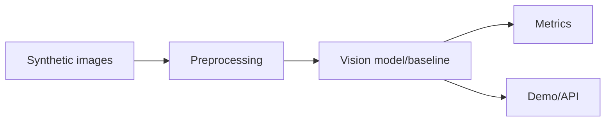

# Deep Learning Vision Lab

Computer-vision defect detection lab using synthetic image data, a fast local baseline, metrics, Streamlit demo, and FastAPI metrics endpoint.

## Problem

Vision systems need dataset generation, preprocessing, evaluation, and deployment surfaces before model complexity matters.

## Demo

```bash
streamlit run projects/deep-learning-vision-lab/app.py
```

## Features

- Synthetic defect dataset generator
- Scratch/crack/OK classes
- Fast baseline classifier
- Accuracy and macro-F1 metrics
- Example predictions
- FastAPI `/metrics` endpoint

## Tech Stack

Python, NumPy, scikit-learn metrics, FastAPI, Streamlit. PyTorch training can be added without changing the project shape.

## Architecture



## Limitations

- Synthetic image data and simple baseline.
- No real manufacturing images or production inspection claims.

## How I Would Improve This In Production

- Add PyTorch CNN/U-Net training, confusion matrices, real defect data, and latency benchmarks.

## What This Proves To Employers

Deep learning workflow understanding, computer vision evaluation, data generation, and inference packaging.

