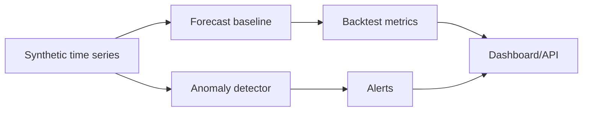

# Time-Series Anomaly Detection and Forecasting

Time-series ML project that forecasts synthetic API traffic and detects anomalous spikes.

## Problem

Operational teams need forecasting and anomaly alerts for traffic, cost, demand, and sensor streams.

## Demo

```bash
streamlit run projects/time-series-anomaly-forecasting/app.py
```

## Features

- Synthetic time-series generator
- Moving-average forecast baseline
- Isolation Forest anomaly detector
- MAE/RMSE/MAPE metrics
- Alert count API
- Streamlit dashboard

## Tech Stack

Python, pandas, NumPy, scikit-learn, FastAPI, Streamlit, pytest.

## Architecture



## Limitations

- Synthetic data only.
- Baseline forecasting rather than full production forecasting stack.

## How I Would Improve This In Production

- Add richer backtesting, seasonality models, alert routing, and data-quality monitoring.

## What This Proves To Employers

Time-series ML, anomaly detection, monitoring, forecasting, and applied data science.

