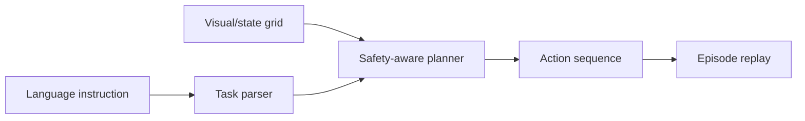

# VLA Embodied Agent Simulator

VLA-inspired simulation that maps natural-language instructions and grid-world state into safe action sequences. This is not a real robot deployment.

## Problem

Robotics/VLA systems need to connect instructions, observations, state, actions, and safety constraints before touching hardware.

## Demo

```bash
streamlit run projects/vla-embodied-agent-simulator/app.py
```

## Features

- Simulated grid-world state
- Natural-language task parser
- Rule-based baseline planner
- Safety constraints and invalid-action handling
- Episode trace and text renderer
- Success/failure metrics through tests

## Tech Stack

Python, Streamlit, dataclass environment, pytest.

## Architecture



## Limitations

- Grid-world only.
- No real vision model, robot hardware, ROS, or learned policy.

## How I Would Improve This In Production

- Add Gymnasium integration, learned policies, richer visual observations, and robotics simulation.
- Add ROS 2 bridge and safety validation before hardware use.

## What This Proves To Employers

VLA concepts, embodied AI simulation, action planning, robotics safety thinking, and practical environment design.

